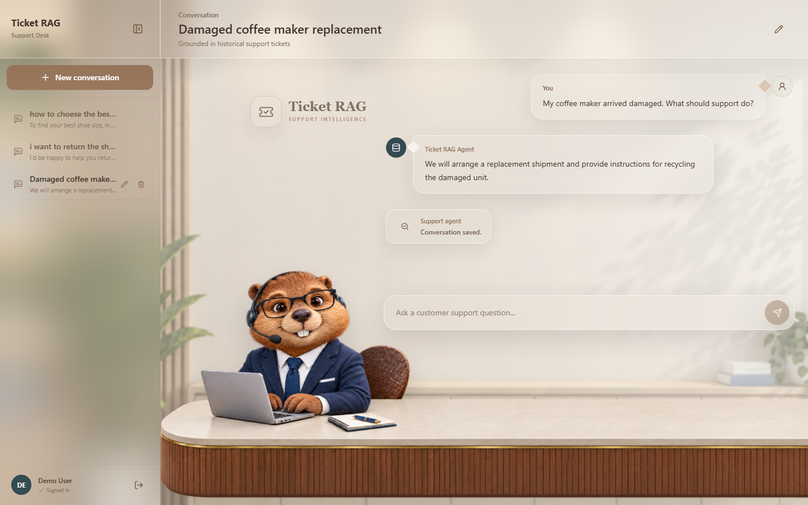
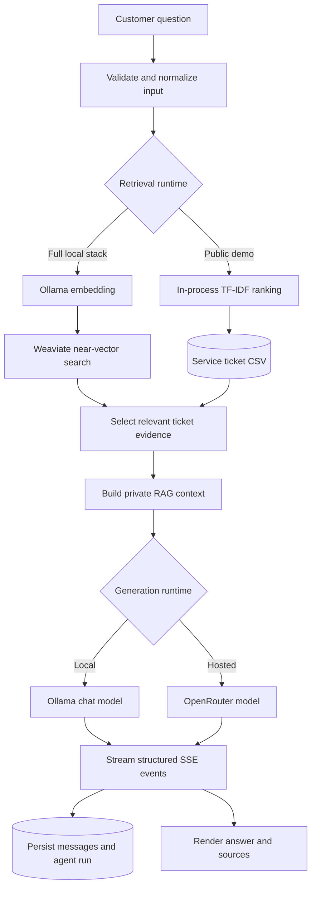

# Ticket RAG Agent

**Live demo: [pew35.github.io/TicketRAGAgent](https://pew35.github.io/TicketRAGAgent/)**

**API docs: [ticket-rag-agent.onrender.com/api/docs/swagger](https://ticket-rag-agent.onrender.com/api/docs/swagger)**

[](https://github.com/pew35/TicketRAGAgent/actions/workflows/deploy-pages.yml)


An Agent Engineering portfolio project that converts historical customer
support tickets into grounded, customer-ready answers. The system retrieves
relevant cases, builds private context, applies behavioral prompt constraints,
streams model output, and persists the complete agent run.

## Live Agent Demo

Use the shared account or register a new one:

- **Email:** `demo@ticketragagent.dev`
- **Password:** `demo`
- **Try:** `My coffee maker arrived damaged. What should support do?`

> The demo uses free infrastructure. The first request after inactivity may
> take up to a minute while the API wakes up.



## Core Features

- Retrieves the most relevant historical support cases for a natural-language
  question.
- Builds a focused RAG context from ticket descriptions and proven resolutions.
- Streams agent status, retrieved sources, answer tokens, errors, and completion
  events over SSE.
- Prevents the final answer from exposing internal ticket IDs, similarity
  scores, or unsupported account actions.
- Generates short conversation titles with validation and deterministic
  fallbacks for invalid model output.
- Persists users, conversations, messages, and agent-run results in PostgreSQL.
- Supports JWT authentication and a responsive conversation workspace.
- Falls back to a grounded ticket answer when the hosted LLM is unavailable.

## Agent Workflow



1. The API validates the question and records a new agent run.
2. The selected retrieval runtime ranks historical tickets against the query.
3. Relevant ticket solutions become private context for the model.
4. The prompt instructs the model to preserve customer facts, avoid unsupported
   claims, and return a concise customer-facing answer.
5. Structured events stream progress, evidence, tokens, and completion data to
   the client.
6. The final response, timing metadata, and conversation title are saved.

## Agent Engineering Highlights

### Retrieval

The full local pipeline cleans ticket data with pandas, creates embeddings with
`nomic-embed-text`, stores vectors in Weaviate, and performs similarity search.
The public deployment uses a lightweight TF-IDF index over the same CSV dataset
so the complete product remains available on free hosting.

### Prompt and context design

Historical tickets are treated as private evidence, not text to repeat. The
prompt requires the model to use only relevant resolution steps, preserve the
customer's product and problem, avoid fabricated policies, and never claim that
an account action has already been completed.

### Streaming agent protocol

The agent exposes a stable event contract:

- `status` reports retrieval and generation progress.
- `sources` returns structured supporting records.
- `token` streams partial model output.
- `error` carries typed failure information.
- `done` closes the run with timing and source metadata.

### Reliability

- Typed business error codes keep failures machine-readable.
- Empty retrieval results are handled as a valid outcome.
- Hosted-model failures fall back to the best retrieved resolution.
- Invalid generated titles fall back to the customer's first question.
- Readiness endpoints verify the database, cache, and active agent runtime.

## Technical Architecture

| Area | Implementation |
| --- | --- |
| Agent and RAG | Python, LangChain, Ollama, Weaviate, TF-IDF, OpenRouter |
| API and streaming | FastAPI, Pydantic, HTTPX, Server-Sent Events |
| State and persistence | PostgreSQL, SQLAlchemy 2 async, Alembic, optional Redis |
| Product interface | React 18, TypeScript, TanStack Query, Zustand, Tailwind CSS |
| Deployment | Docker, Render, GitHub Pages, GitHub Actions |

The FastAPI conversation layer does not depend on one model provider. It can
route requests to the in-process hosted agent or the standalone local agent
service while preserving the same API, event, and persistence contracts.

## Repository Map

```text
agent/
  agent/ticket_agent.py    Local RAG orchestration and streaming
  agent/import_data.py     CSV cleaning, embedding, and Weaviate import
  agent/config.py          Models, prompts, and retrieval configuration
  data/service_tickets.csv Support knowledge base

server/
  server/services/         Hosted agent and Redis integration
  server/web/api/          Auth, conversations, streaming, and monitoring
  server/dao/              Async persistence layer
  server/models/           Users, conversations, messages, and agent runs
  tests/                   Retrieval, fallback, title, and schema tests

frontend/
  src/pages/               Portfolio, authentication, and chat screens
  src/hooks/               Auth and conversation workflows
  src/services/            API and SSE clients
```

## Run and Test

```powershell
# Backend tests
$env:PYTHONPATH = "server"
.\.venv\Scripts\python.exe -m unittest discover -s server/tests -p "test_*.py" -v

# Frontend checks
cd frontend
npm install
npm run lint
npm run build
```

For the complete local vector pipeline, run PostgreSQL and Redis from
`server/deploy/docker-compose.yml`, Weaviate from `agent/docker-compose.yml`,
and pull the `nomic-embed-text` and `llama3.1:8b` Ollama models. The FastAPI
server uses `SERVER_AGENT_MODE=http` to call the local agent service and
`SERVER_AGENT_MODE=internal` for the hosted profile.

## Deployment

- GitHub Pages publishes the React client.
- Render builds the Docker image, runs Alembic migrations, and serves FastAPI.
- A hosted PostgreSQL database stores application and agent-run state.
- OpenRouter provides generation for the public demo.


---

Built by **Peiyi Wu** to demonstrate production-oriented RAG orchestration,
retrieval design, prompt safety, streaming agents, and full-stack AI delivery.
