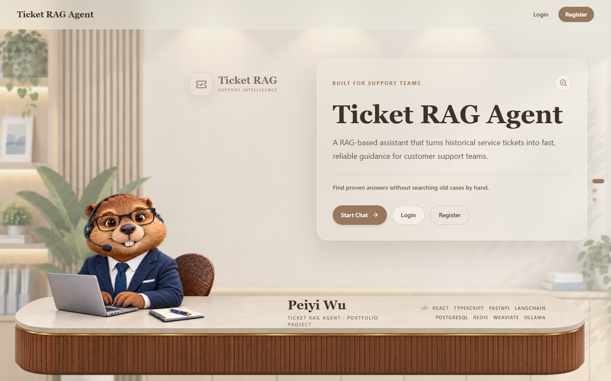
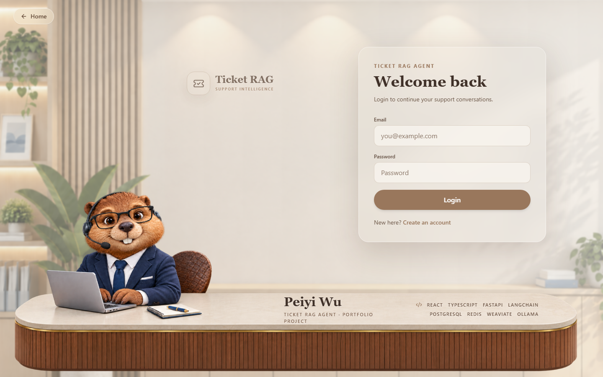
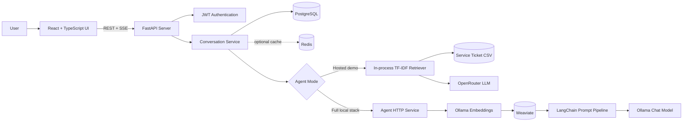

# Ticket RAG Agent

**Live application: [pew35.github.io/TicketRAGAgent](https://pew35.github.io/TicketRAGAgent/)**

**API documentation: [Swagger UI](https://ticket-rag-agent.onrender.com/api/docs/swagger)**

[](https://github.com/pew35/TicketRAGAgent/actions/workflows/deploy-pages.yml)


A full-stack customer-support assistant that turns historical service tickets
into grounded, reusable answers. The application combines retrieval-augmented
generation, streaming chat, persistent conversation history, and secure user
authentication in a polished support-desk experience.

> The public demo runs on free infrastructure. The first request after a period
> of inactivity may take up to a minute while the API wakes up.

## Try the Demo

Use the shared portfolio account or create a new account directly in the app.

- **Email:** `demo@ticketragagent.dev`
- **Password:** `demo`
- **Sample prompt:** `My coffee maker arrived damaged. What should support do?`

The shared account contains sample conversation history. New questions are
retrieved from the ticket knowledge base and answered at runtime.





## Product Highlights

- **Grounded support answers** - retrieves relevant historical resolutions
  before generating a response, reducing unsupported recommendations.
- **Live token streaming** - delivers status, sources, answer tokens, and
  completion events over Server-Sent Events (SSE).
- **Conversation workspace** - creates, renames, deletes, and restores chat
  history from PostgreSQL.
- **Automatic titles** - generates concise conversation titles with guarded
  fallbacks so invalid model output never becomes the visible title.
- **Authentication** - supports registration, JWT access and refresh tokens,
  protected routes, and current-user profiles.
- **Inspectable retrieval** - returns structured source metadata and similarity
  scores for the interface while keeping private ticket details out of the
  customer-facing response.
- **Resilient generation** - falls back to a ticket-grounded response when the
  hosted LLM is unavailable.
- **Operational readiness** - includes health checks, dependency readiness,
  structured errors, database migrations, and containerized deployment.
- **Responsive portfolio UI** - provides desktop and mobile layouts built with
  React, TypeScript, Tailwind CSS, and accessible controls.

## Architecture

The repository supports two RAG runtimes behind the same FastAPI conversation
API. The hosted demo uses a lightweight in-process retriever and OpenRouter,
while the full local stack uses Ollama embeddings, Weaviate vector search, and
an Ollama chat model.



### Request lifecycle

1. The React client sends a question to the protected conversation endpoint.
2. FastAPI validates ownership, stores the user message, and creates an agent
   run record.
3. The active retriever ranks historical service tickets against the question.
4. Relevant resolutions are converted into private prompt context.
5. The model generates a concise customer-facing answer without exposing
   ticket IDs or internal retrieval details.
6. SSE events stream progress and answer tokens to the browser.
7. The completed answer and generated conversation title are persisted in
   PostgreSQL.

## Technology Stack

| Layer | Technologies | Responsibility |
| --- | --- | --- |
| Frontend | React 18, TypeScript, Vite, Tailwind CSS | Responsive UI, protected routing, streaming chat |
| Client state | TanStack Query, Zustand, React Hook Form, Zod | Server cache, authentication state, forms, validation |
| API | FastAPI, Pydantic, Uvicorn, HTTPX | REST endpoints, SSE streaming, validation, agent integration |
| Persistence | PostgreSQL, SQLAlchemy 2 async, Alembic | Users, conversations, messages, agent runs, migrations |
| Local RAG | LangChain, Ollama, Weaviate | Embeddings, vector retrieval, prompt composition, local generation |
| Hosted RAG | In-process TF-IDF retrieval, OpenRouter | Low-cost public demonstration without local AI infrastructure |
| Operations | Docker, Redis, GitHub Actions, Render, GitHub Pages | Containers, optional cache, CI deployment, public hosting |

## Engineering Decisions

### Two deployment profiles

The full local implementation demonstrates a conventional vector RAG stack:
ticket data is cleaned with pandas, embedded through Ollama, stored in
Weaviate, retrieved with near-vector search, and composed into a LangChain
prompt for local generation.

The public profile keeps the entire product usable on free hosting. It loads
the same CSV knowledge base into an in-process TF-IDF index and calls an
OpenAI-compatible hosted model. Both profiles preserve the same conversation,
streaming, persistence, and response contracts.

### Customer-safe prompting

Retrieved tickets are treated as private evidence rather than text to repeat.
The prompt preserves the customer's facts, selects only relevant resolution
steps, avoids claims that an action has already been completed, and never
reveals internal ticket IDs or similarity scores.

### Stable API contracts

Every endpoint uses a consistent `code`, `message`, and `data` envelope.
Expected agent and infrastructure failures map to explicit application error
codes, while streamed events use predictable `status`, `sources`, `token`,
`error`, and `done` event types.

## Repository Structure

```text
TicketRAGAgent/
|-- frontend/                 React + TypeScript application
|   |-- src/api/              HTTP and query-client configuration
|   |-- src/components/       Chat, agent scene, and layout components
|   |-- src/hooks/            Authentication and conversation workflows
|   |-- src/pages/            Home, login, registration, and chat pages
|   `-- src/services/         Auth and SSE chat services
|-- server/                   FastAPI application
|   |-- server/dao/           Async database access layer
|   |-- server/models/        SQLAlchemy domain models
|   |-- server/services/      Hosted RAG and optional Redis services
|   |-- server/web/api/       Users, conversations, monitoring, and docs
|   |-- server/migrations/    Alembic schema and data migrations
|   `-- tests/                Backend unit tests
|-- agent/                    Full local RAG service
|   |-- agent/ticket_agent.py Retrieval and generation orchestration
|   |-- agent/import_data.py  CSV cleaning, embedding, and vector import
|   |-- agent/config.py       Models, prompts, and retrieval settings
|   `-- data/                 Historical service-ticket knowledge base
|-- .github/workflows/        GitHub Pages deployment workflow
|-- Dockerfile                Production multi-stage image
`-- render.yaml               Render Blueprint configuration
```

## Local Development

### Prerequisites

- Node.js 20+
- Python 3.12+
- PostgreSQL 15+
- Docker Desktop for the complete local infrastructure
- Ollama and Weaviate for the full vector RAG profile

### 1. Start PostgreSQL and Redis

```bash
docker compose -f server/deploy/docker-compose.yml up -d
```

### 2. Start the FastAPI server

```bash
python -m venv .venv
# Windows: .venv\Scripts\activate
# macOS/Linux: source .venv/bin/activate
pip install -r server/requirements.txt
cd server
alembic upgrade head
uvicorn server.main:app --reload
```

The API runs at `http://127.0.0.1:8000`; Swagger UI is available at
`http://127.0.0.1:8000/api/docs/swagger`.

### 3. Start the frontend

```bash
cd frontend
npm install
npm run dev
```

Open `http://127.0.0.1:5173`.

### 4. Run the full local RAG service

```bash
ollama pull nomic-embed-text
ollama pull llama3.1:8b
docker compose -f agent/docker-compose.yml up -d
pip install -r agent/requirements.txt
python agent/http_service.py
```

Set `SERVER_AGENT_MODE=http` and keep the default
`SERVER_AGENT_BASE_URL=http://localhost:8001` to route FastAPI requests through
the Ollama and Weaviate agent service.

## Configuration

Important server variables use the `SERVER_` prefix.

| Variable | Description | Public deployment value |
| --- | --- | --- |
| `SERVER_DATABASE_URL` | PostgreSQL connection string | Hosted database URL |
| `SERVER_AGENT_MODE` | Selects `internal` or `http` RAG mode | `internal` |
| `SERVER_LLM_API_KEY` | Hosted model API key | Render secret |
| `SERVER_LLM_API_URL` | OpenAI-compatible completion endpoint | OpenRouter |
| `SERVER_LLM_MODEL` | Hosted chat model | `openrouter/free` |
| `SERVER_REDIS_ENABLED` | Enables the optional Redis client | `false` |
| `SERVER_CORS_ALLOW_ORIGINS` | Allowed frontend origins | Deployment-specific |

Frontend builds use `VITE_API_BASE_URL` to target the deployed FastAPI API.
Secrets are stored by the hosting provider and are never committed to the
repository.

## API Surface

- `POST /api/users/register` - create an account
- `POST /api/users/login` - issue access and refresh tokens
- `GET /api/users/me` - return the authenticated profile
- `GET|POST /api/conversations` - list or create conversations
- `GET|PATCH|DELETE /api/conversations/{id}` - manage one conversation
- `POST /api/conversations/{id}/messages/stream` - stream a grounded answer
- `GET /api/monitoring/readiness` - check database, cache, and agent readiness
- `GET /api/docs/swagger` - browse the interactive API specification

## Testing and Quality

```bash
# Backend tests (PowerShell)
$env:PYTHONPATH = "server"
.\.venv\Scripts\python.exe -m unittest discover -s server/tests -p "test_*.py" -v

# Frontend checks
cd frontend
npm run lint
npm run build
```

The current test suite covers retrieval ranking, grounded fallback responses,
database URL normalization, title sanitization, and demo authentication rules.

## Deployment

- **GitHub Pages** builds and publishes the React frontend on every push to
  `main`.
- **Render** builds the multi-stage Docker image, runs Alembic migrations, and
  serves the FastAPI API plus a fallback copy of the frontend.
- **PostgreSQL** stores authenticated user and conversation data.
- **OpenRouter** supplies the hosted language model used by the public profile.

The deployment definitions are versioned in
[`.github/workflows/deploy-pages.yml`](.github/workflows/deploy-pages.yml) and
[`render.yaml`](render.yaml).

---

Built by **Peiyi Wu** as a portfolio project exploring production-oriented RAG,
streaming AI interfaces, and full-stack application architecture.
